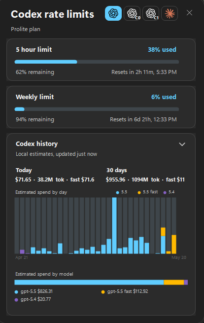

# CodexBarWindows

A small Windows tray app for checking AI coding assistant usage limits without opening a terminal.

CodexBarWindows stays in the system tray. Left-click the tray icon to open a compact popup near the taskbar with tabs for Codex, Claude, and Cursor usage limits, including percentage used, remaining allowance, reset time, and Codex history charts.



## Features

- Native Windows tray app.
- Opens instantly and refreshes usage in the background.
- Shows loading state while usage limits are fetched.
- Dynamically displays every usage window returned for one or more Codex CLI accounts.
- Shows banked Codex reset credits with their expiry, and can redeem one per account when a usage window is nearly exhausted.
- Shows Codex local history charts for estimated 30 day spend and model usage breakdowns from session logs.
- Displays 5 hour and weekly usage windows for Claude Code, plus the Fable 5 limit when Anthropic provides it.
- Displays Cursor Total, Auto, and API usage from cursor.com when a Cursor Cookie header is configured.
- Follows the Windows light/dark system theme.
- Draggable popup.
- Tray context menu for settings, manual update checks, and exit.
- Settings screen for adding extra Codex CLI binary paths.
- Uses the official OpenAI symbol as the tray icon.
- Per-user install script with Windows startup registration.

## Requirements

- Windows 10/11.
- .NET SDK for development and publishing.
- Codex CLI installed and authenticated for Codex limits.
- Optional additional Codex CLI binaries or wrapper scripts for other authenticated accounts.
- Claude Code installed and authenticated for Claude limits.
- A Cursor Cookie header from a signed-in cursor.com browser session for Cursor limits.

The installer publishes a self-contained Windows build, so the installed app does not require a separate .NET runtime.

## Install

From PowerShell:

```powershell
.\Scripts\install.ps1
```

This publishes the app, installs it to:

```text
%LOCALAPPDATA%\Programs\CodexBarWindows
```

It also creates a Start Menu shortcut so `CodexBarWindows` appears in Windows search, and registers the app to start automatically at Windows login using:

```text
HKCU\Software\Microsoft\Windows\CurrentVersion\Run
```

## MSI Installer

Build the MSI locally:

```powershell
.\Scripts\build-installer.ps1
```

The MSI is written to:

```text
Installer\bin\Release\CodexBarWindows-<version>-win-x64.msi
```

Install it silently:

```powershell
msiexec /i .\Installer\bin\Release\CodexBarWindows-0.3.4-win-x64.msi /qn
```

## Uninstall

```powershell
.\Scripts\uninstall.ps1
```

This stops the app, removes the startup entry, and deletes the per-user install folder.

## Development

Run a local debug build:

```powershell
.\Scripts\run.ps1
```

Build manually:

```powershell
dotnet build -c Release -r win-x64
```

Publish manually:

```powershell
dotnet publish .\CodexBarWindows.csproj -c Release -r win-x64 --self-contained:true
```

## Project Layout

```text
Assets/                    App icon and tray logo assets
Installer/                 WiX MSI package definition
Scripts/                   Local run, install, uninstall, and MSI build scripts
CodexBar.Core/            UI-free shared library (settings, providers, updates)
CodexBar.Core/App/        App settings, version info, single-instance guard
CodexBar.Core/Claude/     Claude Code OAuth usage reading
CodexBar.Core/Codex/      Codex CLI/RPC usage reading
CodexBar.Core/Cursor/     Cursor usage reading
CodexBar.Core/Usage/      Shared provider usage models
CodexBar.Core/Updates/    GitHub Releases update checker
Source/App/                Program entry point and tray application context
Source/UI/                 Popup form, meter control, and tray icon rendering
.github/workflows/         Release workflow for building and publishing MSI files
```

The PowerShell scripts are grouped under `Scripts/` because they are the primary local commands for development, install, uninstall, and MSI packaging.

## Versioning

The app version is defined in [Directory.Build.props](Directory.Build.props):

```xml
<VersionPrefix>0.5.0</VersionPrefix>
```

Use semantic versions in the form `major.minor.patch`. MSI upgrades use this version, and the updater compares it against GitHub release tags.

To publish a new version:

```powershell
git tag v0.5.0
git push origin v0.5.0
```

The GitHub Actions release workflow builds an MSI and attaches it to a GitHub Release.

## Auto Updates

Installed builds check GitHub Releases on startup and then every 6 hours. If a newer release exists and includes a `.msi` asset, the app downloads it, exits, installs the update silently, and restarts.

You can also right-click the tray icon and choose `Check for updates`.

Release requirements:

- Tags must look like `v0.5.0`.
- The release must include an MSI asset, for example `CodexBarWindows-0.5.0-win-x64.msi`.
- The new version must be greater than the installed assembly version.

For private repositories, GitHub release checks require authentication. The app checks these sources in order:

- `CODEXBAR_GITHUB_TOKEN`
- `GITHUB_TOKEN`
- `gh auth token`

If the repository is made public later, no token is required.

## How Usage Is Read

For Codex, the app asks the local Codex CLI for live rate limits using the CLI app-server RPC endpoint. It establishes an initial consensus across independent live samples, rejects isolated conflicting windows, and retains the last confirmed snapshot when a refresh fails. Session logs are not used as a rate-limit fallback because they cannot be reliably attributed to the currently selected Codex account.

Codex history charts are local estimates from `%USERPROFILE%\.codex\sessions` and `%USERPROFILE%\.codex\archived_sessions`, or from `%CODEX_HOME%` when set. They also include pi agent sessions from `%USERPROFILE%\.pi\agent\sessions`, or `%PI_HOME%\agent\sessions` when set, for `openai-codex` usage. They summarize recent token rows into a 30 day spend chart and model usage breakdown. Cost values use built-in API-rate estimates and may differ from billing.

The built-in Codex tab uses `CODEX_BINARY` or `PATH`, matching the existing behavior. Extra Codex accounts can be added from the tray icon's `Settings` window by choosing another `codex.exe`, `codex.cmd`, `.bat`, or wrapper script path. Each configured binary is queried separately and appears as its own Codex tab in the tray popup.

No Codex account token is stored by this app. Authentication remains managed by the Codex CLI.

For Claude, the app reads the local Claude Code OAuth credential file at `%USERPROFILE%\.claude\.credentials.json` and calls Anthropic's OAuth usage endpoint. Tokens are read from Claude Code's existing local auth state and refreshed in memory only; this app does not write credentials back to disk.

For Cursor, the app calls cursor.com usage endpoints using a manually configured Cookie header. Paste the header in `Settings` → `Cursor`. The header is stored encrypted for the current Windows user. Stage 1 does not automatically import browser cookies, and Cursor does not currently have a local token/cost history chart.

## Assets

The tray icon is generated from the OpenAI symbol SVG and includes light/dark variants for Windows tray visibility.
